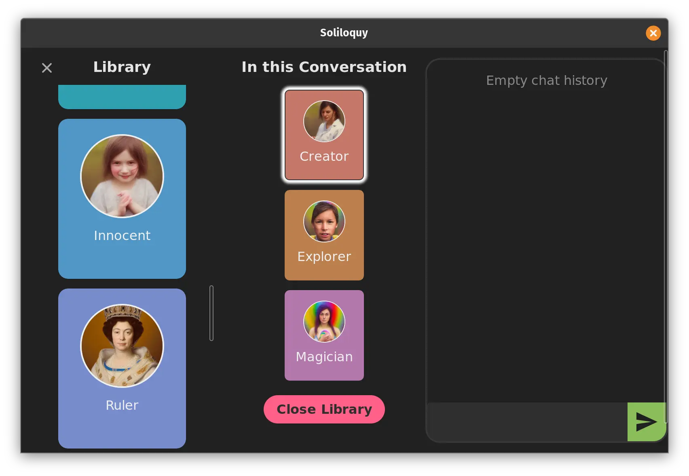
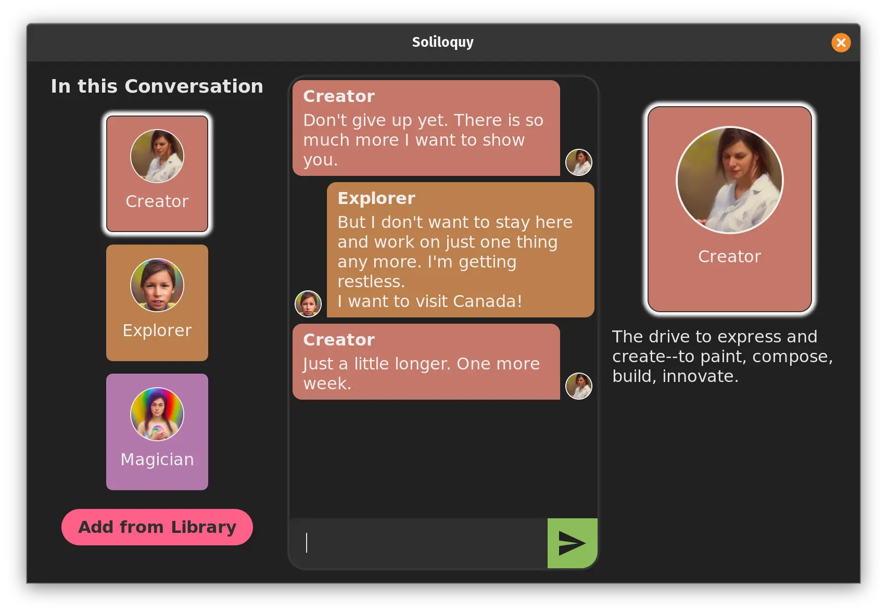

## Description

Soliloquy is a chat app designed to help you <em>
explore dialog between two (or more) imaginary characters.
</em>

Perhaps like the ancient Greek philosophers, you want to more fully
appreciate different sides of an argument; or as a modern reflection,
you want to inquire further into complex, sometimes tentative
positions within your psyche.

Soliloquy lets you create pairs, or groups of "people" that can be
stored as a set. You can recall any set to the stage, where you have
the opportunity to begin a conversation.

<em>Everything is stored locally, on your device.</em> The app never connects
to the internet. You can save conversations, or delete them for privacy.
It's up to you.





## Status

`v0.1.0`: Basic conversation functionality exists, with the ability to choose
personas and switch among them. Only the 12 preset personas work at this time.

## Will it run on my computer?

Soliloquy is intended to run on Linux, Windows, and Mac OS.

## Development

If you'd like to give Soliloquy a spin before its first release, or if
you'd like to help contribute, you can clone this repository and run it using
[neutralinojs](https://neutralino.js.org/):

```
pnpm add -g @neutralinojs/neu

git clone https://github.com/canadaduane/soliloquy
cd soliloquy
pnpm install

pnpm run dev
```
